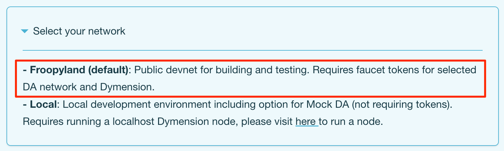
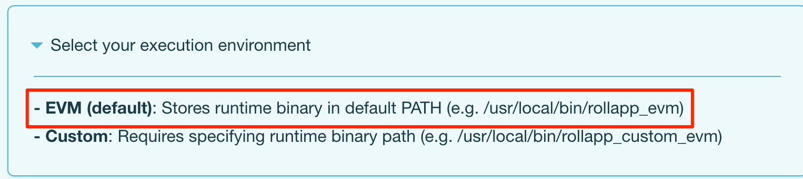
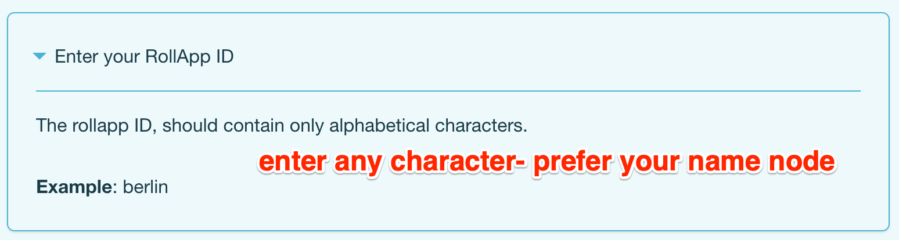
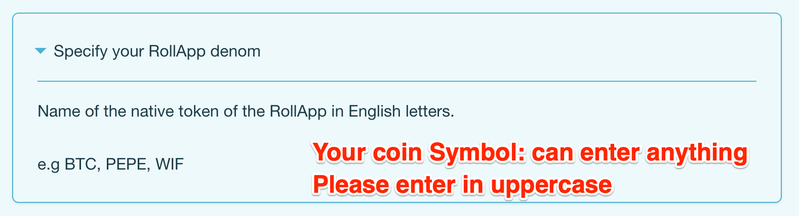
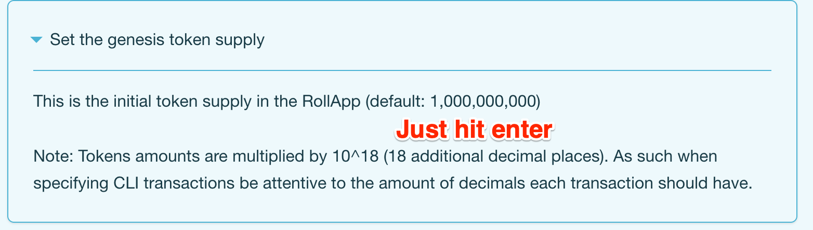
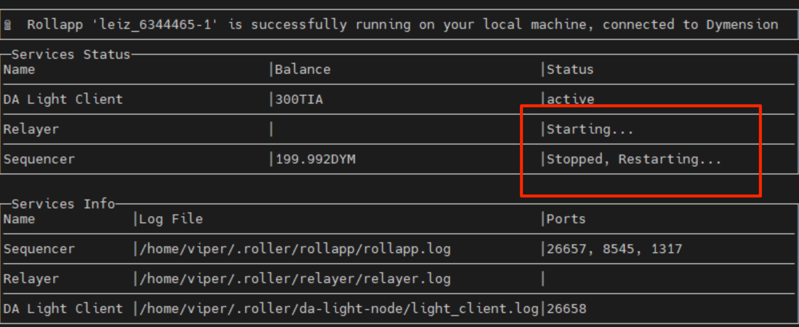
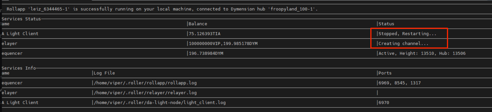
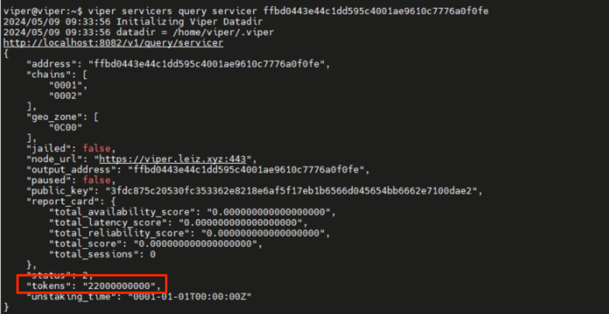
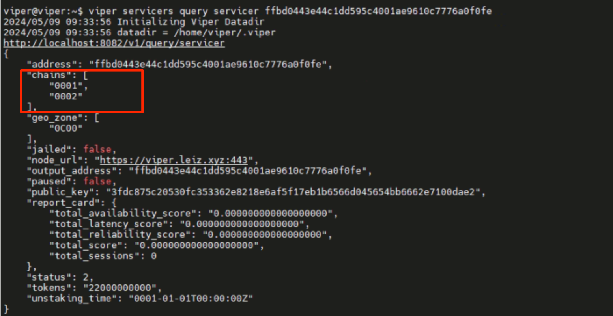

# Viper Private Testnet Validator Node Phase 2


The documentation will guide you through the installation of a new DYM node. It covers both scenarios: setting up a DYM node alongside an existing Viper node and setting up a separate VPS for the DYM node

# Preparation

## Join DYM discord
```
https://discord.gg/dymension

```

## Hardware for DYM node

```

Dual Core
At least 100GB of SSD disk storage
At least 16GB of memory (RAM)
At least 100mbps network bandwidth

```

or you can run together with Viper node

## Install Roller 

```bash
curl -L https://dymensionxyz.github.io/roller/install.sh | bash

```
## Verify Roller version

```bash

roller version

```

You should see something like this

```bash
Roller version <latest-version>
Build time: <build-time>
Git commit: <git-commit>
```

## Initialization


```bash

roller config init --interactive

```

#### Select your network



#### Select your execution environment


#### Enter your rollapp ID


#### Specify your RollAPP denom


#### Set your genesis token supply


#### Choose your data layer


After finishing, you will get the infor

```bash
🔑 Addresses:

Sequencer <network> | Address used to publish state updates to the Dymension Hub
Relayer   <network> | Address that handles the relaying of IBC packets
DA        <network> | Address used to publish data onchain to the DA network

```

## DYM Funding

In Dymension's discord, please fund the Dymension Hub addresses in the `froopyland-faucet` channel with the following command as an example:

```bash
$request <dym-address>
$request <dym-address>
```

## Celestia funding

Go to the room `Froopyland-support` and asking for token. 

Or 

Faucet here:

```bash
https://faucet.celestia-arabica-11.com
```

Or

Go to the Celestia Discord and faucet

## Register DAPP

```bash
roller tx register
```
it should return

```bash
Rollapp '<rollapp-id>' has been successfully registered on the hub.
```

## Running node

```bash
roller run
```

For someone run the node in seperate vps please skip task below and go ahead to #checking DYM node running task

For someone run the DYM node in the same VPS with Viper, let's continue. 
Remember stop the node by run `ctrl +c`

### Update relayer

#### Update configuration

Edit the `~/.roller/relayer/config/config.yaml`

```bash
nano ~/.roller/relayer/config/config.yaml
```

Find and replace: 

`min-loop-duration: 0ms` -> `min-loop-duration: 100ms`

`rule: ""` -> `rule: "allowlist"`

`channel-list: []` -> `channel-list: ["channel-0", "channel-49"]`

#### Update binary

```bash

wget https://github.com/dymensionxyz/go-relayer/releases/download/v0.3.1-v2.5.2-relayer/Cosmos.Relayer_0.3.1-v2.5.2-relayer_linux_amd64.tar.gz

tar -xvf Cosmos.Relayer_0.3.1-v2.5.2-relayer_linux_amd64.tar.gz

mv Cosmos\ Relayer_0.3.1-v2.5.2-relayer_linux_amd64/rly /usr/local/bin/roller_bins/
```
Then running again

### Encounter with bug1: 





the DYM and Viper node is conflicting the port. There are 2 ports that need to changes `26656` and `26657`

### Change for 26657

```bash
roller config set rollapp-rpc-port 6969
```

### Change for 26656

Open the file `~/.roller/rollapp/config/config.toml` and find if there are any port number 26656, please change to any port.

```bash
nano ~/.roller/rollapp/config/config.toml
```

### Encounter with bug2




You catched the bug because your light client is mapping wrong port

Run cmd: 

```bash
roller config set lc-rpc-port 26658
```

## ufw configuration

```bash
sudo ufw allow 6969
sudo ufw allow 8545
sudo ufw allow 1317
sudo ufw allow 26658
```
## Checking DYM node running

```
curl -X POST \
     -H "Content-Type: application/json" \
     --data '{"jsonrpc":"2.0","method":"eth_blockNumber","params":[],"id":1}' \
     http://<your_node_ip>:<your_node_port>
```

replace `http://<your_node_ip>:<your_DYM_node_port>`

if the node responds,

`{"jsonrpc":"2.0","id":1,"result":"xxxxx"}`

this will confirm ur node is working

## Update blockchain.json file

```bash

nano ~/.viper/config/blockchains.json

```

copy and paste: 

```bash
[
  {
    "id": "0001",
    "url": "http://localhost:8082/",
    "basic_auth": {
      "username": "",
      "password": ""
    }
  },
  {
    "id": "0002",
    "url": "http://your-ip:8545",
    "basic_auth": {
      "username": "",
      "password": ""
    }
  }
]
```

if you are runnin dym in seperate, replace `your-ip` with your VPS IP.


If you are running in the same VPS, replease `your-ip` to `localhost`

## Staking 

Rerun Stake Command: 
```bash
viper servicers stake self <addr> <amt> 0001,0002 $GEO-ID <viper node URL> testnet
```

The `viper node URL` is the URL you previously used while staking; `https://$HOSTNAME:443`

Replace `$GEO-ID` with your geographical region ID. Consider using main region IDs such as:

```bash
0A00: North America
0B00: South America
0C00: Europe
0D00: Asia-Pacific
0E00: Middle East & Africa
```

If you had staked with a sub-region geo ID earlier, you can check and update it by running

```bash
cat ~/.viper/config/geozone.json
```

**Noted**: please query your viper validation and take amount the same with current amount as shown in screenshot.
 

After running stake, wait for 1 blocks and check your validation again. 
If you got this, you are success.


Then, restart your viper node

```bash
sudo systemctl restart viper.service
```

# Additionall

Because the DYM node will close when you close terminal session. to keep the section remaining. Please using tmux or screen. 


