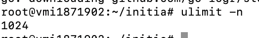
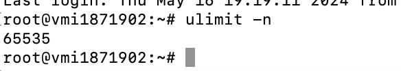

# Initia Validator Node Guildline

# Overview

Operating an Initia node demands significant server resources and is primarily necessary for specific tasks, such as developing dApps or functioning as validators. 

# Hardware

The minimum hardware requirements for running an Initia node are:

```bash
CPU: 4 cores

Memory: 16GB RAM

Disk: 1 TB SSD Storage

Bandwidth: 100 Mbps
```

# OS requirements


# Building Initia

## Step 1

Update all the packages

```bash
sudo apt -q update && sudo apt -yq install curl git jq lz4 build-essential && sudo apt -yq upgrade
```

## Step2: 

Install go version 1.21.10

```bash
wget https://go.dev/dl/go1.22.2.linux-amd64.tar.gz
sudo rm -rf /usr/local/go
sudo tar -C /usr/local -xzf go1.22.2.linux-amd64.tar.gz
echo "export PATH=$PATH:/usr/local/go/bin" >> ~/.profile
source ~/.profile
```

## Step 3

Clone and build the Initia [source code repo](https://github.com/initia-labs/initia).

```bash
cd $HOME
rm -rf initia # run if you have already cloned it.
git clone https://github.com/initia-labs/initia.git
cd initia
git checkout v0.2.14
```

Build binaries

```bash
make build
make install
```

After install successfully, check the initiad version

```bash
initiad version
```
if you encounter with `initiad not found`, 

Adding this under `.bashrc` file

```bash 

nano ~/.bashrc
```

then add this in the end of file. 

```bash
export GOPATH=$HOME/go
export GOBIN=$GOPATH/bin
export PATH=$PATH:$GOBIN
```

Finally, reload the file again

```bash
source ~/.bashrc
```

# Set up Enviroment

Because initia will open amount of file while running. By default, the ubuntu is only allow open 1024 files in paralel 

Therefore, we need to change to another higher number

Check current limitation

```bash
ulimit -n
```


Edit the limit

```bash
sudo nano /etc/security/limits.conf 
```

Add copy and paste to the file

```bash
# /etc/security/limits.conf
#
#Each line describes a limit for a user in the form:
#
#<domain>        <type>  <item>  <value>
#
#Where:
#<domain> can be:
#        - a user name
#        - a group name, with @group syntax
#        - the wildcard *, for default entry
#        - the wildcard %, can be also used with %group syntax,
#                 for maxlogin limit
#        - NOTE: group and wildcard limits are not applied to root.
#          To apply a limit to the root user, <domain> must be
#          the literal username root.
#
#<type> can have the two values:
#        - "soft" for enforcing the soft limits
#        - "hard" for enforcing hard limits
#
#<item> can be one of the following:
#        - core - limits the core file size (KB)
#        - data - max data size (KB)
#        - fsize - maximum filesize (KB)
#        - memlock - max locked-in-memory address space (KB)
#        - nofile - max number of open file descriptors
#        - rss - max resident set size (KB)
#        - stack - max stack size (KB)
#        - cpu - max CPU time (MIN)
#        - nproc - max number of processes
#        - as - address space limit (KB)
#        - maxlogins - max number of logins for this user
#        - maxsyslogins - max number of logins on the system
#        - priority - the priority to run user process with
#        - locks - max number of file locks the user can hold
#        - sigpending - max number of pending signals
#        - msgqueue - max memory used by POSIX message queues (bytes)
#        - nice - max nice priority allowed to raise to values: [-20, 19]
#        - rtprio - max realtime priority
#        - chroot - change root to directory (Debian-specific)
#
#<domain>      <type>  <item>         <value>
#

#*               soft    core            0
#root            hard    core            100000
#*               hard    rss             10000
#@student        hard    nproc           20
#@faculty        soft    nproc           20
#@faculty        hard    nproc           50
#ftp             hard    nproc           0
#ftp             -       chroot          /ftp
#@student        -       maxlogins       4

root                soft    nofile          65535
root                hard    nofile          65535

# End of file
```

then `ctrl+x`, hit `y` and `enter`.

then reboot to update the limit. 

After reboot, check it again



# Set up Cosmovisor

## preparation

```bash
mkdir -p ~/.initia/cosmovisor/genesis/bin
mv  ~/initia/build/initiad ~/.initia/cosmovisor/genesis/bin/
rm -rf build
```

Create the symlink

```bash
sudo ln -s $HOME/.initia/cosmovisor/genesis $HOME/.initia/cosmovisor/current -f
sudo ln -s $HOME/.initia/cosmovisor/current/bin/initiad /usr/local/bin/initiad -f
```

## Install cosmovisor

```bash
go install cosmossdk.io/tools/cosmovisor/cmd/cosmovisor@v1.5.0
```

Create the service

```bash
sudo tee /etc/systemd/system/initia.service > /dev/null << EOF
[Unit]
Description=initia node service
After=network-online.target

[Service]
User=$USER
ExecStart=$(which cosmovisor) run start
Restart=on-failure
RestartSec=10
LimitNOFILE=65535
Environment="DAEMON_HOME=$HOME/.initia"
Environment="DAEMON_NAME=initiad"
Environment="UNSAFE_SKIP_BACKUP=true"
Environment="PATH=/usr/local/sbin:/usr/local/bin:/usr/sbin:/usr/bin:/sbin:/bin:/usr/games:/usr/local/games:/snap/bin:$HOME/.initia/cosmovisor/current/bin"

[Install]
WantedBy=multi-user.target
EOF
```


Run the cosmovisor

```bash
sudo systemctl daemon-reload
sudo systemctl enable initia.service
```

# Initial the node

Create the moniker name

```bash
export MONIKER="YOUR_MONIKER_GOES_HERE"
```

replace your moniker name with `YOUR_MONIKER_GOES_HERE`

Initialize the node

```bash
initiad init $MONIKER --chain-id initiation-1
```


# Download genesis and addrbook

```bash
curl -Ls https://snapshots.t4e.xyz/initia-testnet/genesis.json > $HOME/.initia/config/genesis.json
curl -Ls https://snapshots.t4e.xyz/initia-testnet/addrbook.json > $HOME/.initia/config/addrbook.json
```

# Add seeds

```bash
sed -i -e "s|^seeds *=.*|seeds = \"3f472746f46493309650e5a033076689996c8881@initia-testnet.rpc.t4e.xyz:17959\"|" $HOME/.initia/config/config.toml
```

# Set minimum gas price

```bash
sed -i -e "s|^minimum-gas-prices *=.*|minimum-gas-prices = \"0.15uinit,0.01uusdc\"|" $HOME/.initia/config/app.toml
```

# Set pruning
```bash
sed -i \
  -e 's|^pruning *=.*|pruning = "custom"|' \
  -e 's|^pruning-keep-recent *=.*|pruning-keep-recent = "100"|' \
  -e 's|^pruning-keep-every *=.*|pruning-keep-every = "0"|' \
  -e 's|^pruning-interval *=.*|pruning-interval = "19"|' \
  $HOME/.initia/config/app.toml
```

# Set custom ports
```bash
sed -i -e "s%^proxy_app = \"tcp://127.0.0.1:26658\"%proxy_app = \"tcp://127.0.0.1:17958\"%; s%^laddr = \"tcp://127.0.0.1:26657\"%laddr = \"tcp://127.0.0.1:17957\"%; s%^pprof_laddr = \"localhost:6060\"%pprof_laddr = \"localhost:17960\"%; s%^laddr = \"tcp://0.0.0.0:26656\"%laddr = \"tcp://0.0.0.0:17956\"%; s%^prometheus_listen_addr = \":26660\"%prometheus_listen_addr = \":17966\"%" $HOME/.initia/config/config.toml
sed -i -e "s%^address = \"tcp://localhost:1317\"%address = \"tcp://0.0.0.0:17917\"%; s%^address = \":8080\"%address = \":17980\"%; s%^address = \"localhost:9090\"%address = \"0.0.0.0:17990\"%; s%^address = \"0.0.0.0:9091\"%address = \"0.0.0.0:17991\"%; s%:8545%:17945%; s%:8546%:17946%; s%:6065%:17965%" $HOME/.initia/config/app.toml
```

# Downloading latest chain snapshot

```bash
curl -L https://snapshots.t4e.xyz/initia-testnet/snapshot_latest.tar.lz4 | tar -Ilz4 -xf - -C $HOME/.initia
```


```bash
[[ -f $HOME/.initia/data/upgrade-info.json ]] && cp $HOME/.initia/data/upgrade-info.json $HOME/.initia/cosmovisor/genesis/upgrade-info.json
```

# Start service and check the logs

```bash
sudo systemctl start initia.service && sudo journalctl -u initia.service -f --no-hostname -o cat
```


# Persistent peers

```bash
PEERS=d9cef48445358d3d230c95aef3754c0e1005d7c1@37.27.108.81:31656,610fa5564b1413eeb8c2aec79beda50266128bb8@43.157.20.93:26656,f1c162afb153ed64ebe03e4ec36847c1587c5a24@89.163.255.195:33756,62775997caa3d814c5ad91492cb9d411aea91c58@51.38.53.103:26856,f48610351be116d5e01ebee3e9c6c4178091f480@65.109.113.233:25756
sed -i.bak -e "s/^persistent_peers *=.*/persistent_peers = \"$PEERS\"/" $HOME/.initia/config/config.toml
```

Restart

```bash
sudo systemctl restart initiad && sudo journalctl -u initiad -f
```

# Validator setting up

Official documentation: https://docs.initia.xyz/run-initia-node/running-initia-node/becoming-a-validator

## Create a wallet

First of all we will need to create wallet for our validator. You have two options for that.

### OPTION 1 - CREATE NEW WALLET
```bash
initiad keys add wallet 
```

### OPTION 2 - RECOVER EXISTING WALLET
```bash
 initiad keys add wallet --recover 
 ```

Save the `mnemonic` output as this is the only way to recover your validator wallet in case you lose it!

### List your wallets
```bash
initiad keys list
```

### Fund a wallet
To create validator you have to fund the previously created wallet using https://faucet.testnet.initia.xyz/

To check wallet balance use command below

```bash
initiad q bank balances $(initiad keys show wallet -a)
```

## Create validator

Please make sure you have adjusted `moniker`, `identity`, `detais`, `website` to match your values.

```bash
initiad tx mstaking create-validator \
--amount 1000000uinit \
--pubkey $(initiad tendermint show-validator) \
--moniker "YOUR_MONIKER_NAME" \
--identity "YOUR_KEYBASE_ID" \
--details "YOUR_DETAILS" \
--website "YOUR_WEBSITE_URL" \
--chain-id initiation-1 \
--commission-rate 0.05 \
--commission-max-rate 0.20 \
--commission-max-change-rate 0.05 \
--from wallet \
--fees 5000uinit \
-y
```

Save the `~/.initia/config/priv_validator_key.json` file as this is the only way to recover your validator signing key in case you lose it!

# Set up Oracle

This guide is only for validator nodes

Official documentation: https://docs.initia.xyz/run-initia-node/running-initia-node/oracle


### Step 1: Clone the Repository and build binaries

#### Clone repository
```bash
cd $HOME
rm -rf slinky
git clone https://github.com/skip-mev/slinky.git
cd slinky
git checkout v0.4.3

# Build binaries
make build

# Move binary to local bin
mv build/slinky /usr/local/bin/
rm -rf build
```

### Step 2: Run oracle

#### create the service

```bash
sudo tee /etc/systemd/system/slinky.service > /dev/null <<EOF
[Unit]
Description=Initia Slinky Oracle
After=network-online.target

[Service]
User=$USER
ExecStart=$(which slinky) --oracle-config-path $HOME/slinky/config/core/oracle.json --market-map-endpoint 127.0.0.1:17990
Restart=on-failure
RestartSec=30
LimitNOFILE=65535

[Install]
WantedBy=multi-user.target
EOF
``` 

#### Enable and start service 
```bash
sudo systemctl daemon-reload
sudo systemctl enable slinky.service
sudo systemctl start slinky.service
```
### Step 3: Validating Prices

Upon launching the oracle, you should observe successful price retrieval from the provider sources. Additionally, you have the option to execute the test client script available in the Slinky repository by using the command:

```bash
make run-oracle-client
```
### Step 4: Enable Oracle Vote Extension

In order to utilize the Slinky oracle data in the Initia node, the Oracle setting should be enabled in the `config/app.toml` file.

```bash
###############################################################################
###                                  Oracle                                 ###
###############################################################################
[oracle]
# Enabled indicates whether the oracle is enabled.
enabled = "true"

# Oracle Address is the URL of the out of process oracle sidecar. This is used to
# connect to the oracle sidecar when the application boots up. Note that the address
# can be modified at any point, but will only take effect after the application is
# restarted. This can be the address of an oracle container running on the same
# machine or a remote machine.
oracle_address = "127.0.0.1:8080"

# Client Timeout is the time that the client is willing to wait for responses from 
# the oracle before timing out.
client_timeout = "500ms"

# MetricsEnabled determines whether oracle metrics are enabled. Specifically
# this enables instrumentation of the oracle client and the interaction between
# the oracle and the app.
metrics_enabled = "false"
```

#### Step 5: Check the systemd logs

To check service logs use command below:
```bash
journalctl -fu slinky --no-hostname
```
Successfull Log examples:

__image__