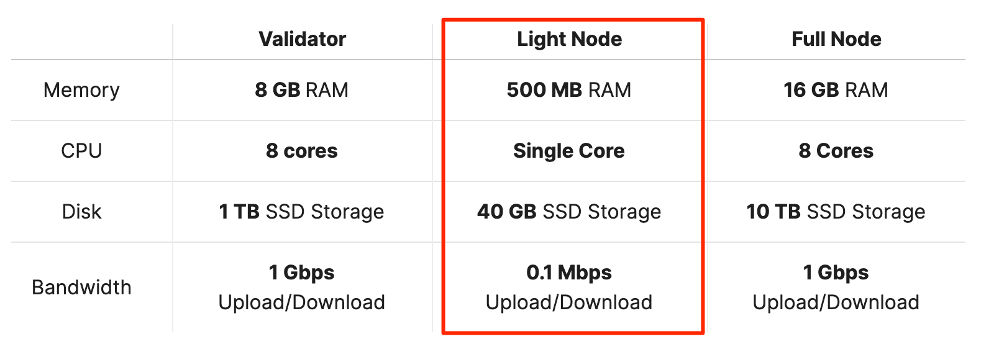
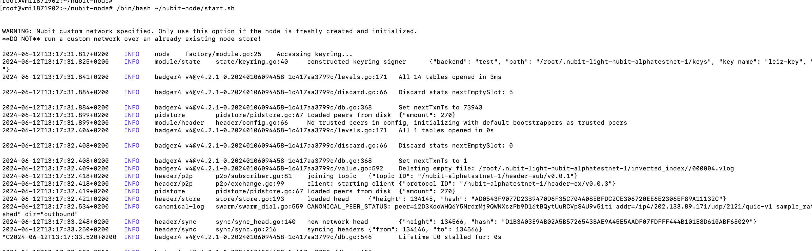
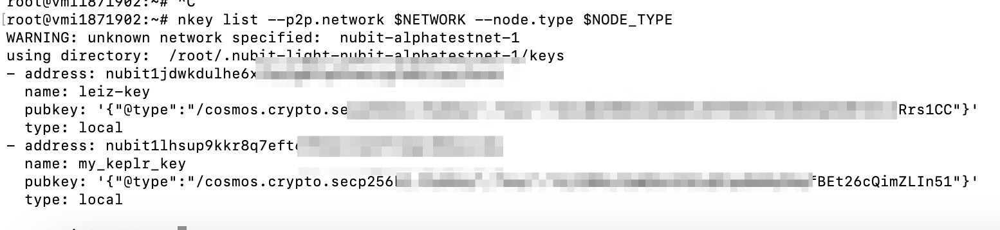
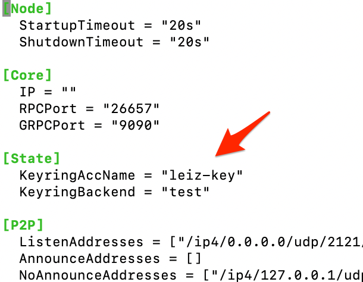
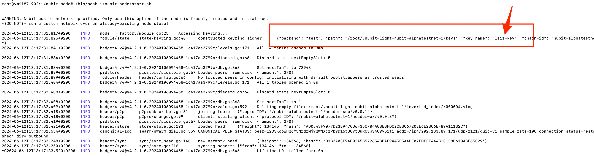

# Nubit Light Node


The documentation will guide you through the installation of a Nubit Light node. It covers both scenarios:
 - running the light node
 - change with your exist mnemonic key

# Official Nubit Documentation

```
https://docs.nubit.org/nubit-da/run-a-node

```

# Hardware for node



# Preparation

```
export YOUR_WALLET_NAME=leiz-key
```

repleace your own wallet name with `leiz-key`

# Install Light Node 

```bash

curl -sL1 https://nubit.sh | bash

```

If your vm is fresh, then the command will do everything for you include:
- Download and extract the nubit-node package
- Generate a new nubit address
- Initiate and start a light node on Nubit’s DA network

For detail, please read it here: `https://docs.nubit.org/nubit-da/run-a-node`

# Stop and Start again the node

Stop: Just press `ctrl+c`

Start: 

```bash
curl -sL1 https://nubit.sh | bash
```

If success, you will see result about the `public key` and `auth_key`




## Change the Wallet key

If you have created the wallet and would like to repleace with your own. please following the step by step: 

Before do it, please stop the node by press `ctrl+c`

### Set up environment

```bash
export PATH=$PATH:$(pwd)/bin
export NETWORK=nubit-alphatestnet-1
export NODE_TYPE=light
export PEERS=/ip4/34.222.12.122/tcp/2121/p2p/12D3KooWJJWdaCB8GRMHuLiy1Y8FWTRCxDd5GVt6A2mFn8pryuf3
export VALIDATOR_IP=validator.nubit-alphatestnet-1.com
export GENESIS_HASH=AD1DB79213CA0EA005F82FACC395E34BE3CFCC086CD5C25A89FC64F871B3ABAE
export AUTH_TYPE=admin
export store=$HOME/.nubit-${NODE_TYPE}-${NETWORK}/
export NUBIT_CUSTOM="${NETWORK}:${GENESIS_HASH}:${PEERS}"
```

### Delete wallet
You can either keep the new one (which created at first run) or delete it. 

To deleted it: 

```bash
rm -r ~/.nubit-light-nubit-alphatestnet-1/keys/
```

Please ignore it command above, if you would like to keep the key. 

### Import wallet with mnemonic

```bash
$HOME/nubit-node/bin/nkey  add $YOUR_WALLET_NAME --recover --keyring-backend test --node.type $NODE_TYPE --p2p.network $NETWORK
```

When run it, you are asked to enter the mnemonic phrase

### Check wallet exists

```bash

$HOME/nubit-node/bin/nkey list --p2p.network $NETWORK --node.type $NODE_TYPE

```

You should see it if you keep the created at first time.



### Add key to nubit node

Let add the wallet name to nubit node before rerun.

```bash
nano ~/.nubit-light-nubit-alphatestnet-1/config.toml
```

Look and change value for `KeyringAccName` then change from `KeyringAccName=""` to `KeyringAccName="leiz-key"`

After changing, try to save but press `ctrl+x` then press `y` and `enter`.

Check for the content file again should be like this



Note: **the name should be the same as the name the import wallet step**

Then rerun the node

```bash
curl -sL1 https://nubit.sh | bash
```

when you see this, you are successful


